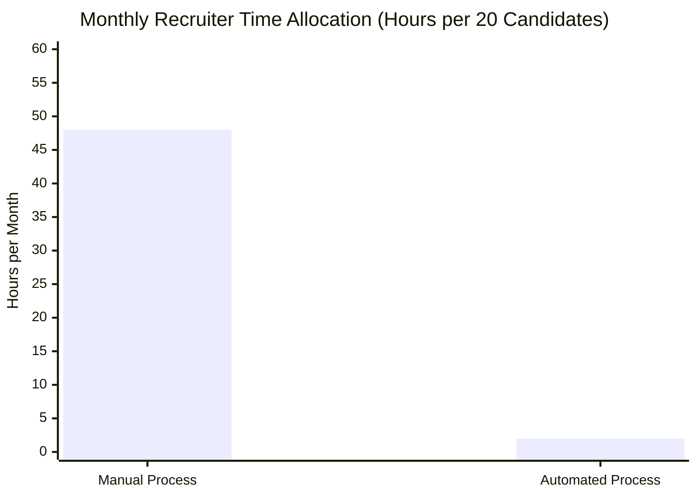
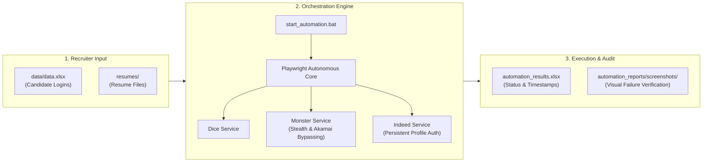

# Recruiter Automation Engine: Executive Briefing & CEO Pitch

> **Project Name**: Recruiter Automation Engine (Dice, Monster, Indeed)  
> **Target Audience**: Chief Executive Officer (CEO), Executive Leadership, Operations Heads  
> **Document Purpose**: Executive summary, business case, ROI calculations, risk mitigations, and presentation runbook.

---

## 1. The 60-Second Elevator Pitch

> *"In recruitment, job board algorithms across Dice, Monster, and Indeed prioritize candidates whose profiles have been refreshed within the last 24 to 48 hours. Previously, our recruiters manually logged in and re-uploaded resumes across multiple sites—a tedious task consuming hours of high-value recruiter time every week.*
> 
> *To eliminate this friction, we engineered the **Recruiter Automation Engine**. It autonomously logs into Dice, Monster, and Indeed, updates each candidate’s resume, bypasses anti-bot barriers, and logs real-time audit reports into Excel—all with a single click.*
> 
> *It cuts administrative grunt work by **over 90%**, ensures our candidate bench stays at the top of client searches for faster placements, and operates with zero recurring third-party software licensing costs."*

---

## 2. The Strategic Problem vs. The Automated Solution

| Dimension | Previous Manual Process (Pain Points) | The Recruiter Automation Engine (Business Gains) |
| :--- | :--- | :--- |
| **Operational Overhead** | Recruiters spend 10–15 minutes per candidate manually cycling through logins, CAPTCHAs, and uploads. | **Zero Grunt Work**: Recruiters fill an Excel sheet, place resumes in a folder, and launch with one click. |
| **Placement Velocity** | When recruiters are busy, refresh cycles slip. Candidate visibility drops off the first page, resulting in fewer client inbound leads. | **Consistent Top Ranking**: Profiles are systematically kept in the *"Active Today"* category, maximizing recruiter discovery. |
| **Software Costs** | Commercial multi-job board tools charge heavy per-seat monthly subscription fees ($100–$300/user/month). | **$0 SaaS Subscriptions**: Developed entirely in-house using enterprise open-source technology (Playwright & TypeScript). |
| **Human Error & Auditing** | Missed platforms, incorrect files uploaded, and zero visibility into which profiles failed to update. | **Full Audit Trail**: Real-time Excel report with timestamps, status codes, and instant failure screenshot captures. |

---

## 3. Hard ROI: The Numbers That Matter

Consider an active bench of **20 candidates** across **3 platforms** (Dice, Monster, Indeed):

### Time and Cost Savings Breakdown

* **Per Candidate Update Cycle**:
  * 3 portals $\times$ ~4 minutes per portal (credentials, 2FA, navigation, upload, verification) = **12 minutes per candidate**.
  * 20 candidates = **240 minutes (4 hours)** per update cycle.
* **Monthly Time Expenditure (3 Updates per Week)**:
  * 4 hours $\times$ 12 cycles/month = **48 hours per month**.
* **With the Automation**:
  * Input preparation: **5–10 minutes** per week ($\approx$ 2 hours/month).
  * Execution: Runs 100% in background unattended.
* **Direct Bottom-Line Return**:
  * **~46 hours saved every month** per 20 candidates.
  * That is over **one full work-week returned to recruiters each month** to dedicate to business development, candidate screening, and client relationships.
  * At an average blended recruiter hourly cost of $35–$50/hr, this generates **$1,600 – $2,300 in recovered recruiter capacity each month** ($19,000 – $27,000/year) on just a 20-candidate scale.

---

## 4. How It Works (High-Level Architecture)

The system was designed for simplicity, requiring zero technical knowledge from end-users:

1. **Input**: Recruiter lists candidate names, logins, and resume file names in `data/data.xlsx`.
2. **Autonomous Execution**: The engine sequentially visits each platform for each candidate:
   * **Dice**: Authenticates, accesses profile, uploads latest resume, and confirms skill-parsing alerts.
   * **Monster**: Injects stealth fingerprints to clear Cloudflare/Akamai bot detection, logs in, and overwrites existing resume.
   * **Indeed**: Employs isolated Chrome profiles to maintain persistent session authentication, navigates Google SSO modals, and uploads new documents.
3. **Auditing & Reporting**:
   * Logs every outcome (`SUCCESS` or `FAILED`) with exact timestamp in `data/automation_results.xlsx`.
   * On failure, captures a full-page screenshot for immediate diagnosis.
   * Accessible via single-click: `view_results.bat`.

---

## 5. Engineering Highlights & Competitive Advantages

Why this is an enterprise-grade automated engine rather than a simple script:

1. **Anti-Bot Stealth Framework**:
   * Websites like Monster employ strict web application firewalls (Cloudflare/Akamai). The engine dynamically masks browser fingerprints, hides `navigator.webdriver`, and introduces randomized human-like delays (`slowMo`).
2. **Persistent Browser Contexts (Indeed SSO & 2FA)**:
   * Repeated 2FA prompts on Google / Indeed are bypassed by persisting candidate session profiles (`temp_chrome_profiles/`), eliminating constant re-authentication blocks.
3. **Fault-Tolerant Isolation**:
   * The platform adapters run independently. If a candidate’s Dice password has expired, the error is caught, screenshotted, and recorded—and the engine moves seamlessly to Monster and Indeed without crashing.
4. **Resilient Excel Handling**:
   * Built-in file-locking retry mechanisms prevent crashes if a recruiter accidentally keeps Excel open during a run.

---

## 6. Executive Q&A: Addressing CEO Concerns

### Q1: *"Is there a risk of our job board accounts getting banned?"*
> **Answer**: *"No. The tool does not perform high-volume scraping or aggressive API spamming. It mirrors genuine human browser behavior, using standard Chrome browser instances with realistic pacing, standard user agents, and localized sessions. To the job portals, it looks like a recruiter logging into their normal browser."*

### Q2: *"Do our recruiters need IT or coding knowledge to run this?"*
> **Answer**: *"None at all. The interface uses standard Excel files that recruiters already work with every day, alongside two simple desktop batch files (`start_automation.bat` and `view_results.bat`)."*

### Q3: *"What happens if a website changes its button or layout?"*
> **Answer**: *"The codebase is designed modularly. Each platform is isolated into its own service file (`diceService.ts`, `monsterService.ts`, `indeedService.ts`). If a site changes its UI, only that specific platform's selector needs a quick update, leaving the rest of the engine operational. The automatic failure screenshots tell us exactly what changed immediately."*

### Q4: *"Can this scale as our candidate volume grows?"*
> **Answer**: *"Yes. The architecture processes batches sequentially to ensure stability and low memory usage. For higher volumes, we can deploy multi-threaded or cloud-based workers to process 50+ candidates in parallel."*

---

## 7. Strategic Future Roadmap

* **Phase 4 — Platform Expansion**: Integrate LinkedIn Recruiter/Job Seeker and ZipRecruiter.
* **Phase 5 — Cloud & Automated Scheduling**: Move execution from local workstations to a secure cloud VM with automated daily cron schedules (e.g., auto-refreshing every morning at 8:00 AM EST).
* **Phase 6 — Notification Webhooks**: Push run summaries and success rates directly to internal Slack or Microsoft Teams channels.

---

## 8. Suggested Meeting Presentation Flow

1. **Hook (30 secs)**: Quote the number of hours currently lost to manual portal uploads.
2. **The Solution (1 min)**: Explain the 1-click automated bot.
3. **Live Demonstration (2 mins)**:
   * Open `data/data.xlsx` showing 1 test candidate.
   * Double-click `start_automation.bat`. Let the CEO watch the browser automatically open, sign in, and complete the update.
   * Double-click `view_results.bat` to show the final timestamped audit log.
4. **ROI Summary (1 min)**: Reiterate the ~46 hours saved monthly and improved candidate visibility.
5. **Close for Approval**: Request greenlight for firm-wide recruiter rollout and Phase 4 roadmap planning.
